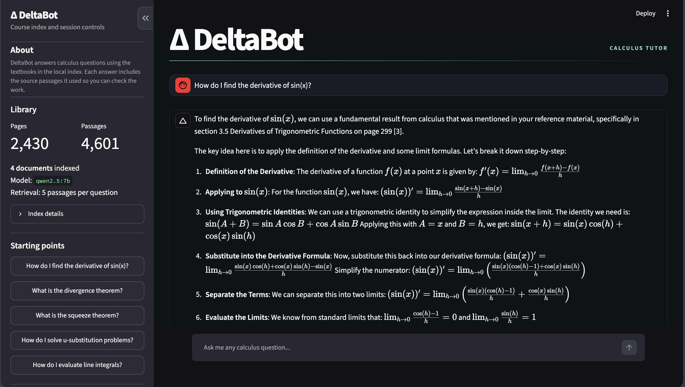

# DeltaBot

A local calculus tutor built with retrieval-augmented generation. It searches a
set of calculus textbooks for relevant passages, gives those passages to a local
language model, and shows the pages it used alongside the answer.

Technology: Python · Streamlit · Ollama · LangChain · Chroma

---



## Overview

I wanted to make a calculus chatbot that does more than generate an answer from
memory. DeltaBot first looks through its course material, retrieves the sections
most related to the question, and uses them as context when writing the response.
This makes the answers easier to verify and gives the student somewhere to go if
they want to read more.

Everything runs locally. Qwen2.5 7B handles the answers through Ollama,
`all-MiniLM-L6-v2` creates the embeddings, and Chroma stores the searchable PDF
index. No API key or paid service is required.

## How it works

1. The PDFs are loaded one page at a time and split into overlapping passages.
2. Each passage is embedded and stored in a local Chroma index.
3. For every question, DeltaBot retrieves the five most relevant passages.
4. The local model receives those passages, the question, and recent conversation
   history, then streams a step-by-step answer with source citations.

The index is reused between launches and automatically rebuilds when the source
files or chunking settings change.

## Setup

```bash
python3.12 -m venv .venv
source .venv/bin/activate
pip install -r requirements.txt
```

Install Ollama, start it in a separate terminal, and download the model:

```bash
brew install ollama
ollama serve
ollama pull qwen2.5:7b
```

Download the OpenStax calculus books and run the app:

```bash
python fetch_sources.py
python -m streamlit run app.py --server.fileWatcherType none
```

The first launch takes a few minutes to build the index. Later launches reuse the
saved index and start much faster.

## Project structure

```text
app.py            Streamlit interface and chat flow
rag.py            PDF loading, indexing, retrieval, and prompt construction
fetch_sources.py  Downloads the OpenStax calculus volumes
sources/          Local course PDFs
requirements.txt  Python dependencies
```

The downloaded textbooks, vector index, virtual environment, and local settings
are gitignored. The small calculus cheat sheet is included so the project still
has a source document before the larger books are downloaded.
